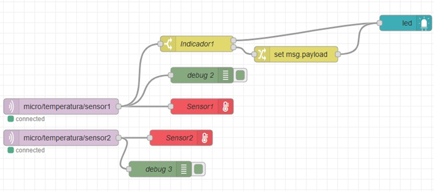
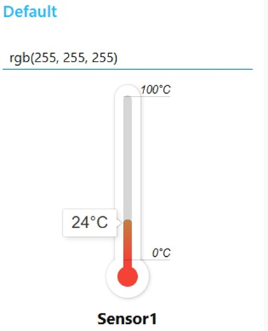
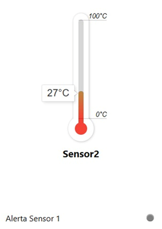
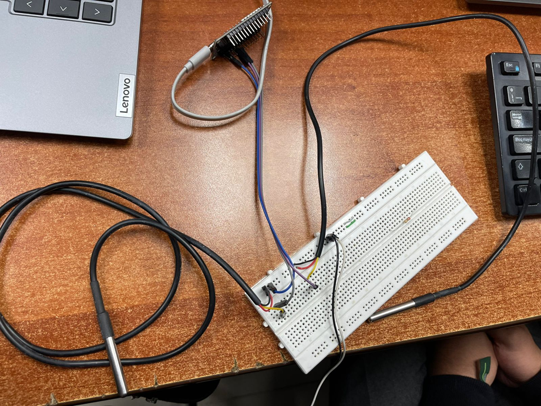
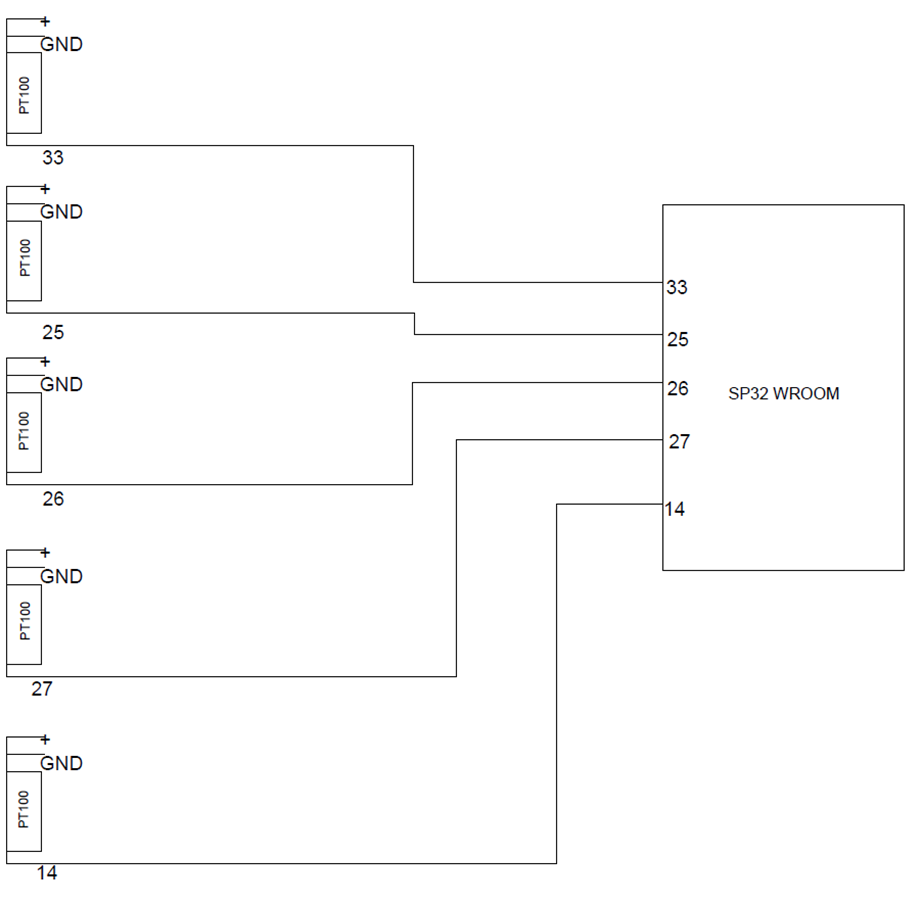
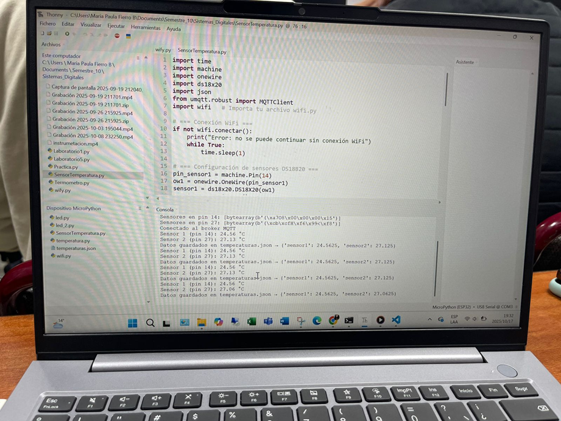

# Proyecto integrador 1ra Entrega

## Integrantes

Maria Paula Fierro Barrios

Astrid Catalina Ortiz Lopez

Camilo Suarez Camacho

## Arquitectura propuesta

Propuesta de implementación en Node-RED
La propuesta consiste en incluir dos sensores de temperatura que permitan visualizar lecturas independientes en el panel de control (Dashboard).
Además, se agrega un indicador visual asociado al primer sensor, con el propósito de controlar una resistencia de calentamiento de la siguiente manera:

- Cuando el sensor 1 detecta una temperatura por debajo del umbral establecido, la resistencia se activa (encendida).
- Cuando la temperatura medida alcanza o supera el límite configurado, el indicador se enciende y simultáneamente la resistencia se apaga, evitando un sobrecalentamiento del sistema.

Esta lógica permite automatizar el control térmico mediante el uso de condiciones (switch o function nodes) en Node-RED, combinando la lectura de los sensores con salidas digitales o visuales.

  
   
  <strong>Figura 1. Diagrama Node-RED</strong>

  
  
   
  <strong>Figuras 2. Sensores</strong>

## Periférico a trabajar

Conexión de los sensores a la ESP32

Dentro de las pruebas realizadas, se conectó la placa ESP32 a dos sensores de temperatura, utilizando los pines 33 y 25 como entradas de lectura.
La configuración se realizó siguiendo el esquema mostrado en las Figuras 3 y 4, donde se observa el cableado correspondiente y la distribución de los componentes sobre la protoboard.

Estas conexiones permitieron obtener mediciones simultáneas de temperatura desde ambos sensores, las cuales fueron posteriormente visualizadas en la interfaz desarrollada en Node-RED.

  
   
  <strong>Figura 3. Conexión a la ESP32 </strong>

  
   
  <strong>Figura 4. Diagrama esquemático</strong>

## Avances

Pruebas funcionales

Dentro de los avances realizados, se efectuaron pruebas simultáneas con los dos sensores de temperatura (PT100) conectados a la ESP32.
Estas pruebas se ejecutaron utilizando el entorno Thonny, donde se cargó y corrió el código correspondiente para la lectura de ambos sensores.

En la consola de Thonny fue posible observar en tiempo real los valores de temperatura detectados por las dos PT100.
Posteriormente, estos datos se visualizaron en la interfaz de Node-RED, evidenciando que ambos sensores enviaban valores de temperatura similares, lo cual confirma el correcto funcionamiento de la comunicación.

  
   
  <strong>Figura 5. Visualización de las lecturas de las PT100 en Thonny</strong>

